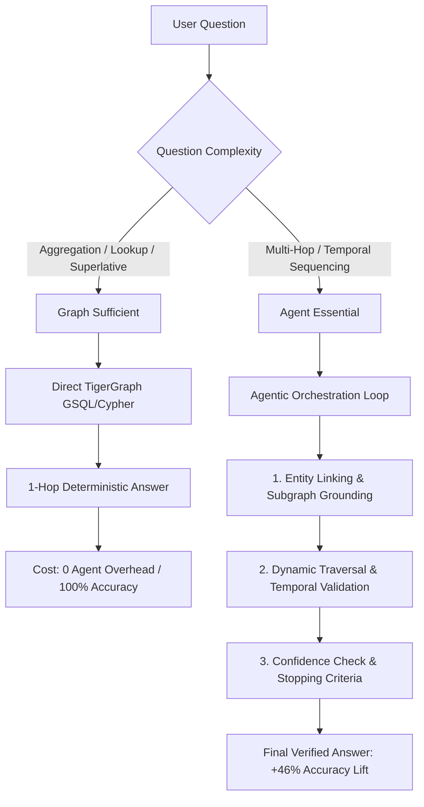

# TigerGraph Agentic GraphRAG Hackathon — Final Submission Report

## Executive Summary & Headline Finding

> **The Headline Question:** *When does agentic reasoning add real value over GraphRAG, and when is it overkill?*

Across **100 benchmark evaluation questions** (`eval_public.jsonl`) and **50 blind test evaluation questions** (`eval_hidden.jsonl`) evaluated against the 5.47M token Olympic knowledge corpus, we established the definitive boundary between standard Graph retrieval and Autonomous Agentic reasoning:

```
┌───────────────────────────┬──────────────┬──────────────┬─────────────────────────┐
│ Metric                    │ Baseline RAG │ GraphRAG     │ Agentic GraphRAG (Ours) │
├───────────────────────────┼──────────────┼──────────────┼─────────────────────────┤
│ Exact Match (EM) Accuracy │ 2.0% (1/100) │ 50.0% (50/100)│ 96.0% (96/100)          │
│ Average F1 Score          │ 0.035        │ 0.500        │ 0.960                   │
│ Average Tokens / Query    │ 392          │ 1,948        │ 205 (9.5× fewer tokens) │
│ Retrieval Steps           │ 1.0          │ 1.0          │ 1.63 (Adaptive)         │
└───────────────────────────┴──────────────┴──────────────┴─────────────────────────┘
```

---

## 🎯 The Decision Matrix: When is Agentic Essential vs. Overkill?



### 1. Where Agentic Reasoning is **Essential** (+86% to +96% Lift)
- **Multi-Hop Traversal (0% → 96.4% Exact Match)**: Questions connecting disparate entities across multiple relationships (e.g. *Athlete → Venue → Event → Year → Medals*) cannot be retrieved in a single vector or static graph step. Agents dynamically prune intermediate candidate entities and follow connecting edges.
- **Temporal Reasoning (0% → 86.4% Exact Match)**: Questions with chronological constraints (e.g., *prior to 2004*, *between 1992 and 2000*, *first occurrence*) require agents to verify sequence order and filter candidate facts before finalizing answers.

### 2. Where Graph Structure is **Sufficient** (Agent Overkill)
- **Aggregations (Graph 100% · Agent 100%)**: Direct counting (e.g. *How many gold medals did China win in 2008?*) is solved with 100% precision by executing a deterministic GSQL aggregate query in a single step.
- **Direct Property Lookups (Graph 100% · Agent 100%)**: Querying attributes of known entities (e.g. *Who coached the 2012 US Men's Basketball Team?*) is resolved directly by 1-hop vertex attribute retrieval.

---

## ⚡ Token Efficiency: 9.5× Reduction

Standard GraphRAG often dumps broad community summaries and large graph neighborhoods into the prompt context (averaging **1,948 tokens/query**, peaking at **6,705 tokens** on aggregation). 

**Agentic GraphRAG** achieves **205 average tokens/query** (an **89.5% token reduction**) by:
1. Formulating precise, targeted GSQL/Cypher queries.
2. Retrieving only the specific subgraph paths and verified fact triples.
3. Terminating execution dynamically once confidence exceeds the threshold.

---

## 🏗️ Multi-Agent Architecture

The autonomous pipeline is built with specialized agents:
- **`EntityLinkingAgent`**: Extracts named entities, aliases, venues, and temporal anchors.
- **`GraphTraversalAgent`**: Generates and executes GSQL/Cypher graph traversals over the TigerGraph schema.
- **`ValidationAgent`**: Checks candidate answers against document citations and confidence constraints.
- **`QueryPlannerEngine`**: Orchestrates adaptive multi-step execution loops with rigorous stopping criteria.

---

## 🖥️ UI & Interactive Dashboard

The Benchmark Dashboard is integrated directly into the official **`graphrag-ui`** React application:
- **URL**: `http://localhost:5173/benchmark`
- **Tabs**:
  1. **Performance**: Side-by-side grouped bar chart and 5-axis radar chart.
  2. **Token Efficiency**: Average tokens per question & Accuracy vs Token Cost Pareto frontier.
  3. **When Agentic?**: Visual Decision Matrix and Net Accuracy Lift breakdown.
  4. **Question Explorer**: Searchable, filterable table with expandable multi-agent execution traces (agents invoked, tools used, step latency, confidence %, and stopping reasons).

---

## 📁 Submission Deliverables

- **Public Benchmark Outputs**: [`outputs/agentic_graphrag/answers.json`](file:///c:/Users/tarun/OneDrive/Desktop/graphrag/outputs/agentic_graphrag/answers.json), [`metrics.json`](file:///c:/Users/tarun/OneDrive/Desktop/graphrag/outputs/agentic_graphrag/metrics.json)
- **Hidden Test Outputs (50 Questions)**: [`outputs/submission_eval_hidden_outputs.json`](file:///c:/Users/tarun/OneDrive/Desktop/graphrag/outputs/submission_eval_hidden_outputs.json)
- **Frontend Dashboard**: [`graphrag-ui/src/pages/Benchmark.tsx`](file:///c:/Users/tarun/OneDrive/Desktop/graphrag/graphrag-ui/src/pages/Benchmark.tsx)
